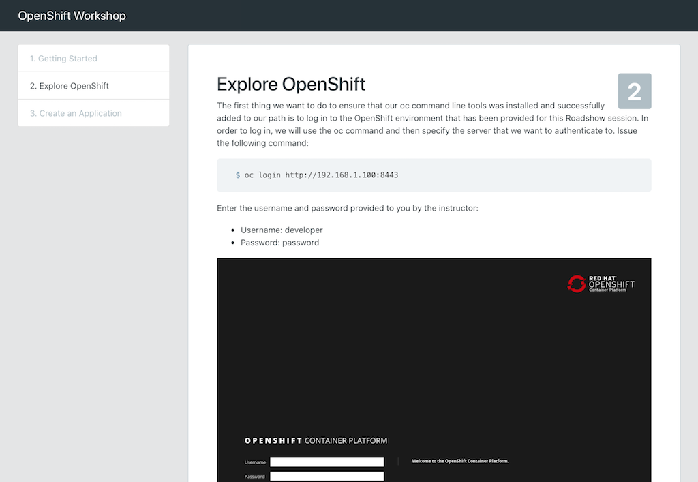
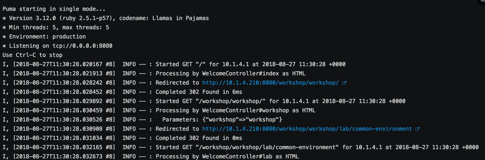
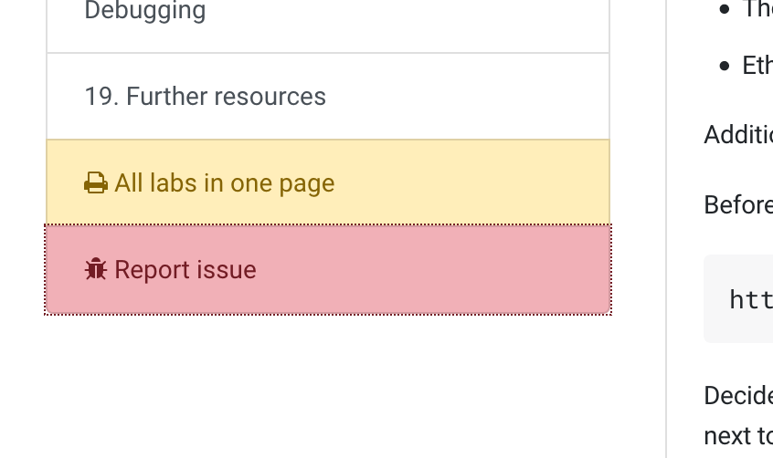

# Getting Started

Workshopper is an engine for building a web-based workshop
or lab guides. The content of each lab could be written in Markdown or AsciiDoc.



## File Structure

Every workshop will consist, at least, of the following files:

### [`_modules.yml`](ModuleConfiguration.md)

Lists all labs, their dependencies and where the lab content is hosted (GitHub, web server, etc). Note that this file has to be in the root of the repository.

### [`_workshop1.yml`](WorkshopConfiguration.md)

A yaml file with arbitrary name that specifies which labs should be included in the rendered workshop guide. Note that the lab names should already be listed in `_modules.yml`. It goes without going that you can have multiple of these yaml files to customize your workshop for different purposes.

### `*.md` or `*.adoc`

The actual lab instructions depending on which markup language you have chosen (specified in `_modules.yml`). Note that the name of the file should be the exact same name as the key in `_modules.yml`.

| NOTE: If you need a template project with an skeleton to build your workshop, you can easily [clone this repository](https://github.com/siamaksade/workshopper-template) and update it to your needs. |
| --- |

## Run locally

You can directly run Workshopper as a docker container which is specially helpful when writing the content.

```bash
docker run -it --rm -p 8080:8080 -v $(pwd):/app-data \
              -e CONTENT_URL_PREFIX="file:///app-data" \
              -e WORKSHOPS_URLS="file:///app-data/_workshop.yml" \
              -e LOG_TO_STDOUT=true
              quay.io/osevg/workshopper
```

Go to [http://localhost:8080](http://localhost:8080) on your browser to see the rendered workshop content. You can modify the lab instructions and refresh the page to see the latest changes.

## Run in OpenShift

You can deploy Workshopper as a container image anywhere but most conveniently, you can deploy it on OpenShift Online or other OpenShift flavours:

```bash
$ oc new-app quay.io/osevg/workshopper --name=myworkshop \
      -e WORKSHOPS_URLS="https://raw.githubusercontent.com/openshift-evangelists/workshopper-template/master/_workshop.yml" \
      -e LOG_TO_STDOUT=true 
$ oc expose svc/myworkshop
```

The lab content (.md and .adoc files) will be pulled from the GitHub when users access the workshopper in their browser.

| NOTE: the workshop variables can be overriden via specifying environment variables on the container itself e.g. the LOG_TO_STDOUT env var in the above command |
| --- |

## Run in OpenShift with Workshopper template

| NOTE: WRITE-ME |
| --- |

## Basic Configuration
There is some basic configuration that will be useful for every workshop. For advanced configuration read [here](AdvancedConfiguration.md).

### View logs

By default, workshopper will not log to stdout and you will not be able to see the log output. If you want to see the log output you need to enable `LOG_TO_STDOUT` environment variable.

```bash
-e LOG_TO_STDOUT: true
```

This will show the following:



### Report issues link

If you want your workshops to show a report issues link, you need to add the URL for the issue tracker as value to ISSUES_URL environment variable.

```bash
-e ISSUES_URL=https://github.com/openshift-labs/starter-guides/issues
```

This will show the following:


