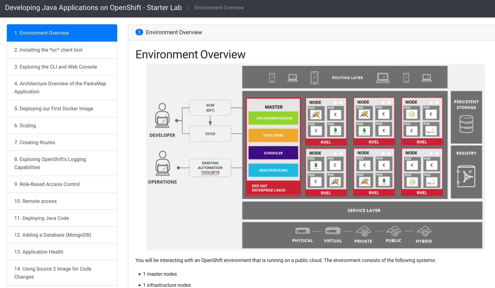

# Documentation for Workshopper
This is a tool for creating nice Workshops developed by the OpenShift Evangelist team.

* [Getting started](GettingStarted.md)
* [Advanced configuration](AdvancedConfiguration.md)
* [Module reference documentation](ModuleConfiguration.md)
* [Write a workshop](WriteAWorkshop.md)
* [Examples](Examples.md)
* [Run as S2I](s2i.md)
* [Developing/Confibuting](Contributing.md)
